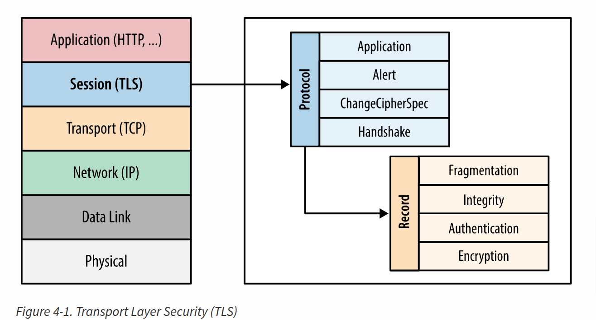

## **Introduction to TLS**

- Initially developed as **SSL (Secure Sockets Layer)** by Netscape for securing e-commerce transactions.
- Purpose: 
	- **Encryption**: Protects customer data.
	- **Authentication**: Verifies the parties involved.
	- **Integrity**: Ensures data remains unaltered.
- **Layer**: Operates at the **application layer**, directly on top of **TCP**, ensuring unchanged operation of protocols like HTTP, email, etc.

### **Capabilities of TLS/SSL**

- Prevents third parties from reading or modifying data.
- Observers can infer only:
    - Connection endpoints.
    - Type of encryption used.
    - Frequency and approximate amount of data sent.

### **Best Practices**

- **Always Prefer Latest Version**:
    - Servers should use the **latest stable version** for optimal **security, performance, and capability guarantees**.
    - Example: **HTTP/2** mandates TLS 1.2 or higher; connections will fail otherwise.

## Encryption, Authentication, and Integrity in TLS

TLS ensures secure communication by offering three key mechanisms:

1. **Encryption**:
    - Obfuscates the data exchanged between hosts to prevent eavesdropping.
    - Ensures confidentiality of transmitted data.
2. **Authentication**:
    - Verifies the validity of identification materials (e.g., certificates).
    - Ensures the identity of the server (and optionally the client) is genuine.
3. **Integrity**:
    - Detects and prevents message tampering and forgery.
    - Ensures that data has not been altered during transmission.

### **TLS Handshake**

- **Purpose**: Establishes a secure communication channel.
- **Mechanism**:
    - Uses **public key cryptography** (asymmetric encryption) to negotiate a **shared secret key**.
    - This is done securely even over an unencrypted channel and without prior knowledge between peers.

### **Authentication Process**

- **Server Authentication**:
    - The client verifies the server's identity (e.g., a bank website).
    - Prevents spoofing by validating against a **chain of trust** (Certificate Authorities).
- **Optional Client Authentication**:
    - A server can verify the client's identity using unique client certificates (e.g., employees authenticated by a company proxy).

###  **Message Integrity**

- TLS signs messages using a **Message Authentication Code (MAC)**:
    - The MAC is a cryptographic hash function (checksum).
    - Both peers negotiate the keys for the MAC during the handshake.
    - The sender appends the MAC value to the message.
    - The receiver verifies the MAC to ensure the integrity and authenticity of the message.
